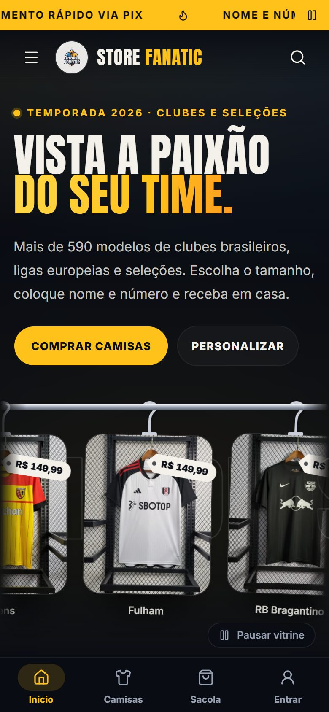
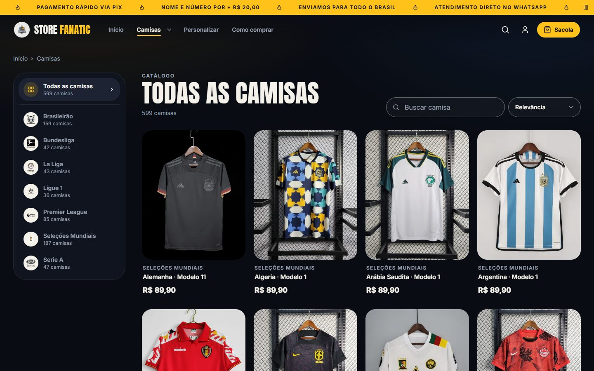
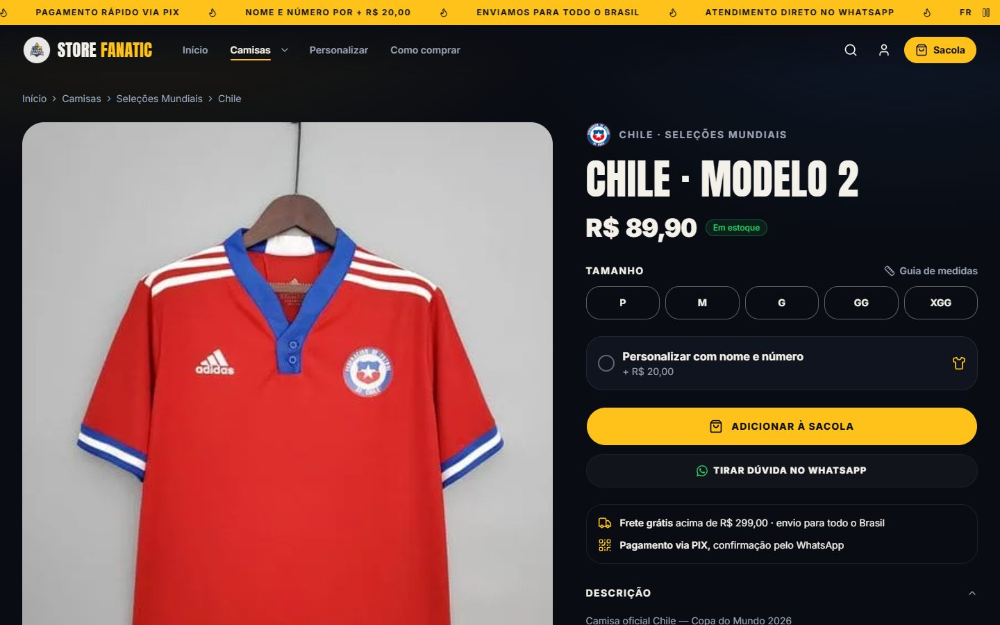
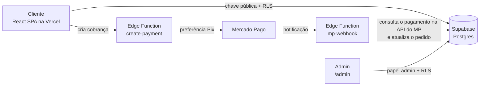

# Store Fanatic

> E-commerce de camisas de futebol: 599 modelos de 7 ligas, personalização com nome e número, pagamento via Pix e painel administrativo completo.

**[Ver a loja no ar →](https://store-fanatic.vercel.app)**


<table>
  <tr>
    <td width="38%"></td>
    <td><br><br></td>
  </tr>
</table>

---

## O problema

Lojas pequenas de camisas vendem pelo Instagram e pelo WhatsApp: o catálogo fica espalhado em fotos, o cliente pergunta o preço de cada modelo, e o pagamento e a personalização são combinados manualmente, um por um. A Store Fanatic organiza o catálogo inteiro em um site, deixa o cliente montar o pedido sozinho (tamanho, nome e número), cobra via Pix e entrega ao lojista um painel para acompanhar tudo.

## O que o projeto faz

**Para o cliente**

- Catálogo com 599 camisas de 7 ligas (Brasileirão, Premier League, La Liga, Serie A, Bundesliga, Ligue 1 e seleções), com filtro por liga, busca e ordenação
- Página de produto com seleção de tamanho, guia de medidas e personalização com nome e número (+ R$ 20,00)
- Sacola persistente (sobrevive ao recarregar a página), cupons de desconto e frete grátis acima de R$ 299,00
- Checkout com validação de formulário e pagamento via **Mercado Pago (Pix)**
- Rastreio do pedido por link e área "Meus pedidos" para quem tem conta

**Para o lojista (`/admin`)**

- Visão geral de vendas e pedidos
- Gestão de produtos, ligas, usuários, cupons e configurações da loja
- Fluxo de status do pedido: `aguardando_pagamento → pago → enviado → entregue` (ou `cancelado`)
- Status de pagamento atualizado automaticamente pelo webhook do Mercado Pago

**Experiência**

- Mobile first, com barra de navegação inferior no celular e mega menu no desktop
- Animações de rolagem e de vitrine que respeitam `prefers-reduced-motion`
- Modais e menus com _focus trap_ para navegação por teclado

## Arquitetura



- **Frontend:** SPA em React 19 servida pela Vercel. Fala direto com o Supabase usando só a chave pública. Quem decide o que cada usuário pode ler ou escrever é o banco, via Row Level Security.
- **Preço:** o navegador nunca define quanto o pedido custa. Gatilhos no banco recalculam o preço de cada item pelo catálogo, o frete e o cupom, e a tela do Pix mostra o total gravado.
- **Pagamento:** o token do Mercado Pago fica apenas nas Edge Functions (Deno), nunca no navegador. O webhook não confia no corpo da notificação: ele busca o pagamento na API do Mercado Pago e só marca o pedido como pago se o valor recebido cobrir o total.
- **Papéis:** o papel de admin fica em `profiles.role` e é protegido por um gatilho (`protect_profile_role`), que impede o próprio usuário de se promover a admin.

## Segurança: o que auditei e corrigi

Antes de considerar a loja pronta, testei o banco usando apenas a chave pública, que fica exposta no JavaScript de qualquer site, e documentei cada correção em uma migration:

| Migration | Problema encontrado | Correção |
|---|---|---|
| [`008`](supabase/migration_008_rls_privacidade_pedidos.sql) | Qualquer visitante conseguia listar todos os pedidos (nome, CPF, telefone, endereço) e alterá-los, inclusive marcando como pago | Políticas de RLS por dono do pedido e por papel; gatilho que protege o cargo de admin |
| [`009`](supabase/migration_009_hardening.sql) | Tabelas internas sem RLS (alerta crítico do Security Advisor) | RLS ligado em `activity_logs`, `payment_records` e `keep_alive`, sem política de leitura pública |
| [`010`](supabase/migration_010_funcoes.sql) | A função `execute_sql` permitia rodar SQL arbitrário pela API pública; funções com `search_path` mutável | `execute_sql` trancada; `search_path` fixado em todas as funções |
| [`011`](supabase/migration_011_politicas_catalogo.sql) | Políticas antigas `FOR ALL USING (true)` deixavam qualquer um escrever no catálogo | Catálogo com leitura pública e escrita só para admin |
| [`012`](supabase/migration_012_grants_funcoes.sql) | Funções `SECURITY DEFINER` executáveis por qualquer usuário | `EXECUTE` revogado de `PUBLIC`/`anon`; cupom só para usuário logado |
| [`013`](supabase/migration_013_total_do_pedido_no_servidor.sql) | O total do pedido e o preço de cada item vinham do navegador: dava para gravar uma camisa de R$ 149,90 por R$ 1,00 | Gatilhos recalculam no banco o preço de cada item pelo catálogo, o frete e o cupom; o Pix mostra o total gravado pelo banco |

Os scripts de seed também deixaram de ter chaves no código e passaram a ler tudo de um `.env` local, que é ignorado pelo Git.

## Stack

| Camada | Tecnologias |
|---|---|
| Interface | React 19, TypeScript, Vite, Tailwind CSS 4, shadcn/ui (Radix), Framer Motion |
| Estado e formulários | Zustand (sacola persistida), React Hook Form, Zod |
| Backend | Supabase (Postgres, Auth, Storage, Row Level Security), Edge Functions em Deno |
| Pagamento | Mercado Pago Checkout Pro com Pix e webhook |
| Infraestrutura | Vercel (frontend), Supabase (banco e funções) |

## Como rodar localmente

**Pré-requisitos:** Node.js 22+ e um projeto no [Supabase](https://supabase.com) (o plano gratuito serve).

```bash
git clone https://github.com/lucas-s-santos/store-fanatic.git
cd store-fanatic
npm install
cp .env.example .env   # preencha VITE_SUPABASE_URL e VITE_SUPABASE_ANON_KEY
```

1. No SQL Editor do Supabase, execute [`supabase/setup-new-project.sql`](supabase/setup-new-project.sql) e depois as migrations de `008` a `013`, nessa ordem.
2. Para o pagamento, publique as Edge Functions e configure o token do Mercado Pago:

   ```bash
   supabase functions deploy create-payment
   supabase functions deploy mp-webhook --no-verify-jwt
   supabase secrets set MERCADO_PAGO_ACCESS_TOKEN=seu_token
   ```

3. Rode o projeto:

   ```bash
   npm run dev
   ```

Para entrar no painel, crie uma conta pelo site e mude o `role` dela para `admin` na tabela `profiles`.

| Script | O que faz |
|---|---|
| `npm run dev` | Servidor de desenvolvimento |
| `npm run build` | Checagem de tipos e build de produção |
| `npm run lint` | ESLint |
| `npm run preview` | Serve o build localmente |

## Estrutura

```
src/
├── pages/          # Rotas da loja e do painel (/admin/*)
├── components/
│   ├── home/       # Vitrine, ligas, "Como comprar", personalização
│   ├── layout/     # Header, mega menu, barra inferior, sacola, rotas protegidas
│   ├── product/    # Card, visualização rápida, visualizador com inclinação
│   └── ui/         # Componentes base (shadcn/ui)
├── lib/            # Cliente Supabase, Mercado Pago, autenticação, hooks
└── store/          # Sacola (Zustand)
supabase/
├── functions/      # create-payment e mp-webhook (Deno)
└── *.sql           # Schema e migrations, incluindo as de segurança
scripts/            # Seed do catálogo e upload de imagens (rodam localmente)
```

## Autor

Feito por **Lucas Silva dos Santos**: [portfólio](https://lucas-portfolio-opal.vercel.app) · [LinkedIn](https://www.linkedin.com/in/lucas-silva-dos-santos-31026726a) · [GitHub](https://github.com/lucas-s-santos)
